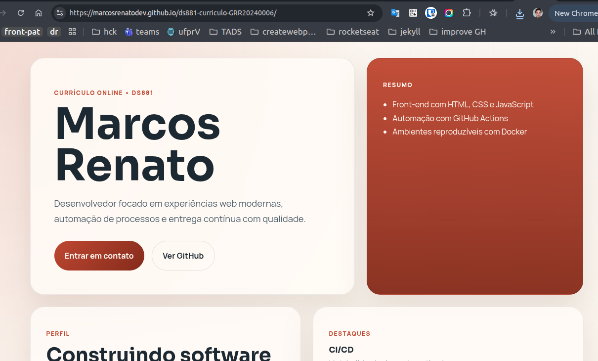
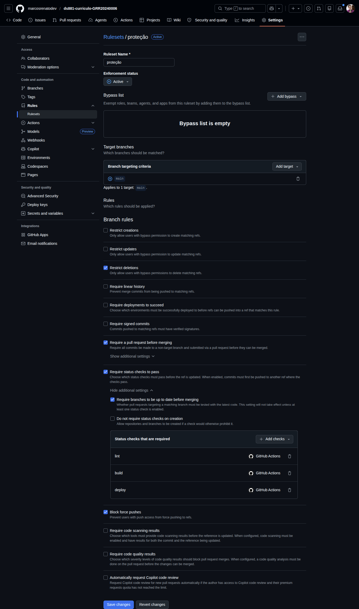

# Currículo Online DS881

Currículo/portfólio profissional estático publicado com GitHub Pages, desenvolvido com Vite e preparado para desenvolvimento local via Docker.

## Link em produção

`https://marcosrenatodev.github.io/ds881-curriculo-GRR20240006/`

### Evidência da aplicação em produção



## Stack adotada

- Vite para servir e gerar a aplicação estática
- HTML, CSS e JavaScript puro para a interface
- pnpm como gerenciador de pacotes
- Docker e Docker Compose para o ambiente local
- GitHub Actions para lint, build e deploy
- GitHub Pages para hospedagem

## Como executar localmente com Docker

### Pré-requisitos

- Docker
- Docker Compose

### Subir o ambiente

```bash
docker compose up --build
```

Depois disso, acesse:

`http://localhost:8080`

### Como funciona

- O serviço usa o `Dockerfile` baseado em `node:20-alpine`
- O `docker-compose.yml` sobe o servidor nativo do Vite
- O diretório do projeto é montado com bind mount em `/app`
- A pasta `/app/node_modules` fica isolada dentro do contêiner para preservar as dependências
- A porta do servidor interno é exposta em `8080:8080`
- O hot reload funciona automaticamente ao salvar alterações nos arquivos do projeto

### Encerrar o ambiente

```bash
docker compose down
```

## Scripts úteis

```bash
pnpm install
pnpm dev
pnpm lint
pnpm build
pnpm preview
```

## Pipeline de CI/CD

O workflow está em [`.github/workflows/main.yml`](./.github/workflows/main.yml) e executa:

1. `lint`: instala dependências e roda `pnpm lint`
2. `build`: valida a geração da aplicação com `pnpm build`
3. `deploy`: publica automaticamente no GitHub Pages após `push` na branch `main`

O deploy só acontece em `push` na `main`. Em `pull_request`, o pipeline valida lint e build para garantir que o merge só ocorra com a esteira verde.

## Governança de código

### Fluxo adotado

- Não realizar `push` direto na `main`
- Criar branches como `feat/site-inicial`, `fix/ajuste-readme`, `ci/github-pages`
- Abrir Pull Request para integrar mudanças
- Exigir sucesso do GitHub Actions antes do merge
- Usar mensagens no padrão Conventional Commits, como:
  - `feat: add landing page do curriculo`
  - `ci: add github pages workflow`
  - `docs: update local setup instructions`

## Proteção da branch `main`

Descrição da configuração aplicada no GitHub:

- Branch protegida: `main`
- Exigir Pull Request antes do merge
- Exigir aprovação ou, no mínimo, revisão do próprio fluxo via PR antes de integrar
- Exigir status checks aprovados antes do merge
- Selecionar o workflow do GitHub Actions deste repositório como check obrigatório
- Bloquear `push` direto na `main`

### Evidência da configuração no GitHub



## Estrutura do projeto

```text
.
├── .github/workflows/main.yml
├── Dockerfile
├── docker-compose.yml
├── eslint.config.js
├── index.html
├── main.js
├── package.json
├── styles.css
└── vite.config.js
```
